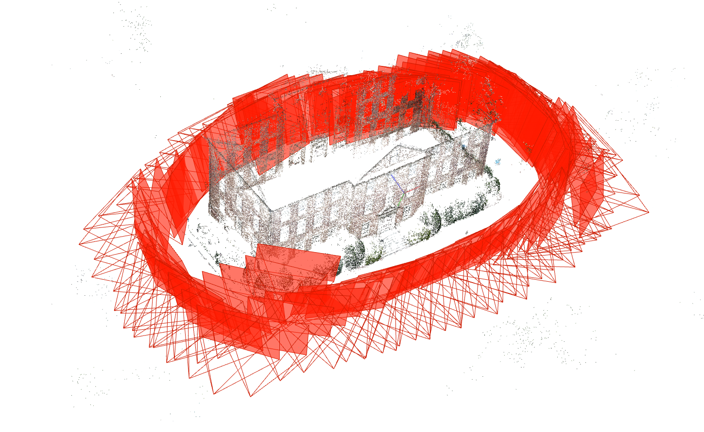

DockerFile of COLMAP
=======================

A minimal Docker wrapper around the official **[`colmap/colmap`](https://hub.docker.com/r/colmap/colmap)** image, plus recipes for  
* GPU (CUDA) execution  
<!-- * Sparse & dense reconstruction from the command line   -->
* Launching the COLMAP GUI via X11  
* Exporting results for MeshLab / CloudCompare / Blender

#### Tested on
* Ubuntu 22.04 + NVIDIA driver 560.xx  
* Docker ≥ 24.x  
* NVIDIA Container Toolkit (nvidia‑docker2)  
* CUDA 12.6 inside the container



### Build the image

```bash
docker build -t colmap:latest .
```


### Prepare a dataset

Put your images to `/datasets/images` or download sample dataset from https://demuc.de/colmap/datasets/ and unzip them to `/datasets` folder.

Recommended layout (relative to the repo root):
```
datasets/
└── south-building/
    └── images/            # 128 JPEGs; any dataset works
workspace/
```

### Run the GUI (GPU or CPU)

```bash
xhost +local:root

docker run --rm -it --gpus all \
  -e DISPLAY=$DISPLAY \
  -e QT_X11_NO_MITSHM=1 \
  -v /tmp/.X11-unix:/tmp/.X11-unix \
  -v "$(pwd)/datasets/south-building/images:/data/images:ro" \
  -v "$(pwd)/workspace:/data/work" \
  colmap:test colmap gui
```

- In the GUI choose File ▸ Open -> `/data/work`
- Import images (`/data/images`) if prompted
- Run Reconstruction ▸ Feature -> Match -> Mapper as usual

### One‑shot sparse reconstruction (CLI)

```bash
docker run --rm -it --gpus all \
  -v "$(pwd)/datasets/south-building/images:/data/images:ro" \
  -v "$(pwd)/workspace:/data/work" \
  colmap:test bash -c "
    colmap feature_extractor --database_path /data/work/db.db \
                             --image_path /data/images \
                             --ImageReader.camera_model SIMPLE_RADIAL \
                             --ImageReader.single_camera 1 && \
    colmap exhaustive_matcher --database_path /data/work/db.db && \
    mkdir -p /data/work/sparse && \
    colmap mapper --database_path /data/work/db.db \
                  --image_path    /data/images \
                  --output_path   /data/work/sparse
  "
```

### Visualise results

#### 1. Inside COLMAP GUI

Open `/data/work/sparse/0` (or `dense/fused.ply`) in the left sidebar.

#### 2. MeshLab / CloudCompare / Blender

Convert text model to PLY

```bash
docker run --rm \
  -v "$(pwd)/workspace:/data/work" \
  colmap:test colmap model_converter \
      --input_path  /data/work/sparse/0 \
      --output_path /data/work/sparse/0/points3D.ply \
      --output_type PLY

```